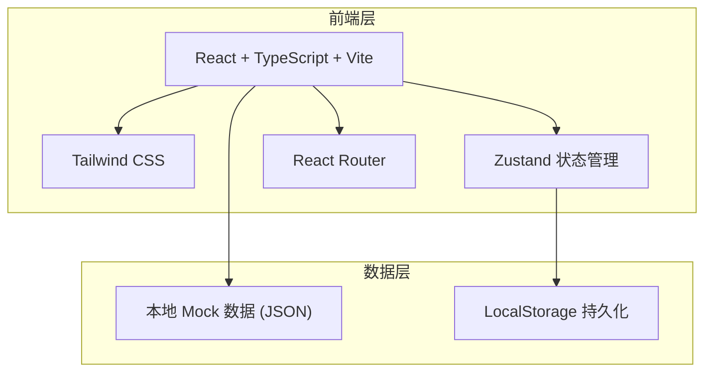
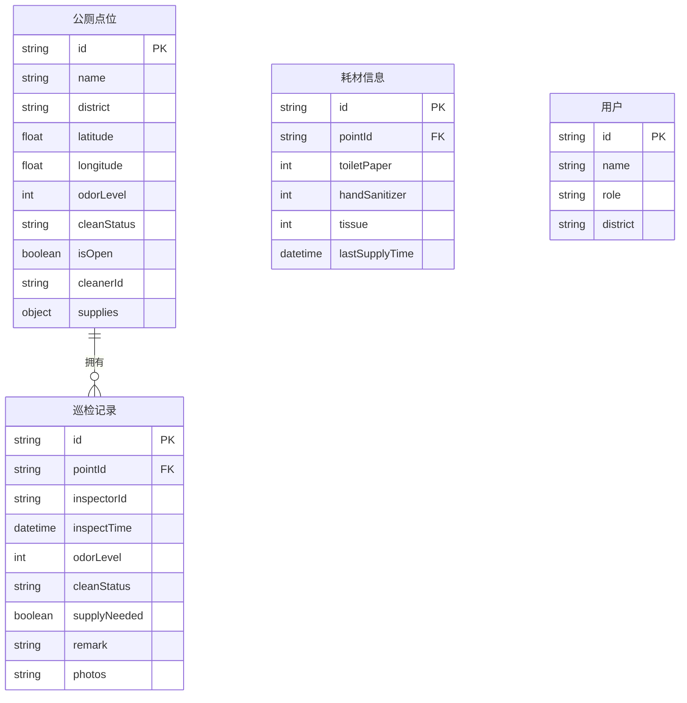

## 1. 架构设计



## 2. 技术说明

- 前端：React@18 + TypeScript + Tailwind CSS@3 + Vite
- 初始化工具：vite-init
- 后端：无（纯前端，本地数据）
- 数据库：无（使用本地 JSON Mock 数据 + LocalStorage 持久化）
- 状态管理：Zustand
- 路由：React Router DOM v6
- 图标：lucide-react
- 地图：Leaflet + react-leaflet（开源地图库）

## 3. 路由定义

| 路由 | 用途 |
|------|------|
| `/` | 巡检首页 - 地图总览 + 点位列表 |
| `/inspect/:id` | 巡检录入 - 填写巡检表单 |
| `/points` | 点位管理 - 筛选、搜索、详情 |
| `/export` | 数据导出 - 筛选导出 CSV |

## 4. 数据模型

### 4.1 数据模型定义



### 4.2 核心类型定义

```typescript
interface ToiletPoint {
  id: string;
  name: string;
  district: string;
  latitude: number;
  longitude: number;
  odorLevel: 1 | 2 | 3 | 4 | 5;
  cleanStatus: 'clean' | 'normal' | 'dirty';
  isOpen: boolean;
  cleanerId: string;
  supplies: {
    toiletPaper: number;
    handSanitizer: number;
    tissue: number;
  };
  lastInspection?: string;
}

interface InspectionRecord {
  id: string;
  pointId: string;
  inspectorId: string;
  inspectorName: string;
  inspectTime: string;
  odorLevel: 1 | 2 | 3 | 4 | 5;
  cleanStatus: 'clean' | 'normal' | 'dirty';
  supplyNeeded: boolean;
  remark: string;
  photos: string[];
}

type UserRole = 'cleaner' | 'supervisor' | 'citizen';
```
